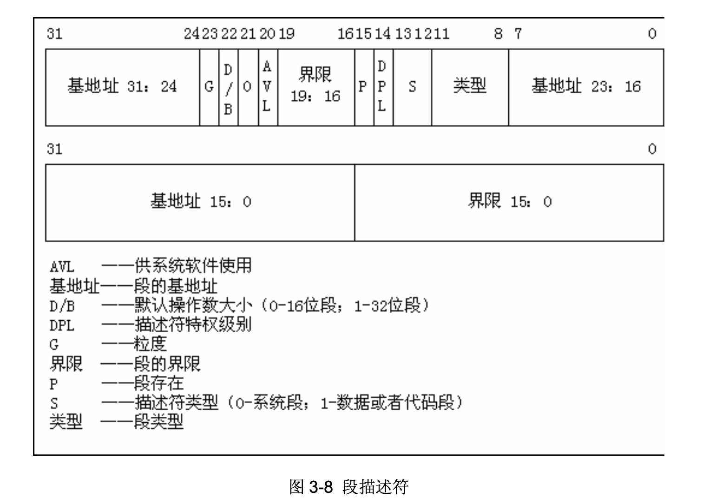
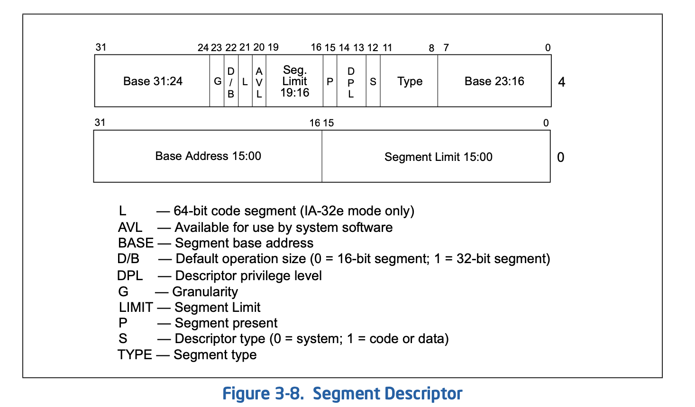

### 1、计算内核代码段、数据段的段基址、段限长、特权级。



（这中文版没有标出来这俩4字节的地址谁是高地址的，而且DPL只有一位，估计是搞错了）



G: 

- If the granularity flag is clear, the segment size can range from 1 byte to 1 MByte, in byte increments.
- If the granularity flag is set, the segment size can range from 4 KBytes to 4 GBytes, in 4-KByte increments.

```asm
_gdt:	.quad 0x0000000000000000	/* NULL descriptor */
	.quad 0x00c09a0000000fff	/* 16Mb */
	.quad 0x00c0920000000fff	/* 16Mb */
	.quad 0x0000000000000000	/* TEMPORARY - don't use 为了隔开*/
	.fill 252,8,0			/* space for LDT's and TSS's etc */
```

* 代码段：

| Base(00) G(1) Limit(0) | Base(00)              |
| ---------------------- | --------------------- |
| 00 c0                  | 9a（1**00**1 1010）00 |
| Base                   | Limit                 |
| 0000                   | 0fff                  |

Base: 0x00

Limit: 0x0fff -> 2^12 * 4KB = 16MB

特权级（dpl）：0

* 数据段：

| Base(00) G(1) Limit(0) | Base(00)       |
| ---------------------- | -------------- |
| 00 c0                  | 9(1**00**1)200 |
| Base                   | Limit          |
| 0000                   | 0fff           |

Base: 0x00

Limit: 0x0fff -> 2^12 * 4KB = 16MB

dpl：0

### 2、计算进程0的代码段、数据段的段基址、段限长、特权级。

```c
// sched.c
#define INIT_TASK \
... 
{ \
		{0,0}, \
/* ldt */	{0x9f,0xc0fa00}, \
		{0x9f,0xc0f200}, \
	}, \
...

```

```C
// LDT写好看点：
	{ \
/*NULL*/		{0,0}, \
/* cs */  	{0x0000_009f,0x00c0_fa00}, \ 
/* ds */		{0x0000_009f,0x00c0_f200}, \
	}, 
```


* 代码 0 640K

| Base(00) G(1) Limit(0) | Base(00)              |
| ---------------------- | --------------------- |
| 00 c0                  | fa（1**11**1 1010）00 |
| Base                   | Limit                 |
| 0000                   | 009f                  |

Base: 0x00

Limit: 0x9f * 4KB = 640 KB

dpl：3

* 数据 0 640K

| Base(00) G(1) Limit(0) | Base(00)              |
| ---------------------- | --------------------- |
| 00 c0                  | F2（1**11**1 0010）00 |
| Base                   | Limit                 |
| 0000                   | 009f                  |

Base: 0x00

Limit: 0x9f * 4KB = 640 KB

dpl：3


### 3、fork进程1之前，为什么先调用move_to_user_mode()？用的是什么方法？解释其中的道理。

> Linux 规定，除进程 0 之外，所有进程都是由一个已有进程在3特权级下创建的。


利用中断机制和`iret`指令。

```c
#define move_to_user_mode() \
__asm__ ("movl %%esp,%%eax\n\t" \
	// 中断硬件压栈
	// 0x17: 用户进程数据段 ss
	"pushl $0x17\n\t" \
	// esp
	"pushl %%eax\n\t" \
	// eflag
	"pushfl\n\t" \
	// 用户进程代码段 cs
	"pushl $0x0f\n\t" \
	// 1f 往前1 eip
	"pushl $1f\n\t" \

	// iret 中断返回， 特权集，中断硬件压栈
	"iret\n" \
	"1:\tmovl $0x17,%%eax\n\t" \
	"movw %%ax,%%ds\n\t" \
	"movw %%ax,%%es\n\t" \
	"movw %%ax,%%fs\n\t" \
	"movw %%ax,%%gs" \
	:::"ax")
```

> 为了iret的正确使用，设计者手工写压栈代码模拟int的压栈，当执行iret指令时 ，CPU自动这5个寄存器的值按序恢复 CPU， CPU就会翻转到3特权级的 段执 3特权级的进程代码。
>
> 为了iret能翻转到3特权级 不仅手工模拟的压栈顺序必须正确 而 SS、CS的特权 级还必须正确 注 :栈中的SS值 0x17，用二进 表示就 00010111，最后两 表示 3，是用户特权级倒数3位1，表示从LDT中获取段描述符第4~5位10表示从 LDT的 3项中得到进程栈段的描述符。
>
> 当执行ret时，硬件会技序 5个push压栈的数据分别出栈 SS、ESP、EFLAGS、 CS、BEIP。压栈顺序与通常中断返回时硬件的出栈动作一样，返回的效果也是一样 。
>
> 执行moveto_user_mode()，相当于进行了一次中断返回，进程0的特权级从0翻转为3，成 名副其实的进程。

### 4、根据什么判定move_to_user_mode()中iret之后的代码为进程0的代码。

`sched.h`中

```c
	ltr(0); // task register 设置为0号进程的tss
	lldt(0); // ldt
```

已经将进程0的tss和ldt装入tr和ldtr了


### 5、进程0的task_struct在哪？具体内容是什么？给出代码证据。

在`sched.h`

```C
#define INIT_TASK \
/* state etc */	{ 0,15,15, \
/* signals */	0,{{},},0, \
/* ec,brk... */	0,0,0,0,0,0, \
/* pid etc.. */	0,-1,0,0,0, \
/* uid etc */	0,0,0,0,0,0, \
/* alarm */	0,0,0,0,0,0, \
/* math */	0, \
/* fs info */	-1,0022,NULL,NULL,NULL,0, \
/* filp */	{NULL,}, \
	{ \
		{0,0}, \
/* ldt */	{0x9f,0xc0fa00}, \
		{0x9f,0xc0f200}, \
	}, \
/*tss*/	{0,PAGE_SIZE+(long)&init_task,0x10,0,0,0,0,(long)&pg_dir,\
	 0,0,0,0,0,0,0,0, \
	 0,0,0x17,0x17,0x17,0x17,0x17,0x17, \
	 _LDT(0),0x80000000, \
		{} \
	}, \
}
```

具体内容是进程0的task_struct.

```c
// sched.c
union task_union {
	struct task_struct task;
	char stack[PAGE_SIZE]; // 内核栈
};

static union task_union init_task = {INIT_TASK,};
```


### 6、在system.h里

 ```C
 \#define _set_gate(gate_addr,type,dpl,addr) \
 __asm__ ("movw %%dx,%%ax\n\t" \
    "movw %0,%%dx\n\t" \
    "movl %%eax,%1\n\t" \
    "movl %%edx,%2" \
    : \
    : "i" ((short) (0x8000+(dpl<<13)+(type<<8))), \
    "o" (*((char *) (gate_addr))), \
    "o" (*(4+(char *) (gate_addr))), \
    "d" ((char *) (addr)),"a" (0x00080000))

\#define set_intr_gate(n,addr) \
    _set_gate(&idt[n],14,0,addr)

\#define set_trap_gate(n,addr) \
    _set_gate(&idt[n],15,0,addr)

\#define set_system_gate(n,addr) \
    _set_gate(&idt[n],15,3,addr)
 ```
### 读懂代码。这里中断门、陷阱门、系统调用都是通过_set_gate设置的，用的是同一个嵌入汇编代码，比较明显的差别是dpl一个是3，另外两个是0，这是为什么？说明理由。

dpl为0意味着只能由内核处理，即中断门和陷阱门只能由内核使用。dpl为3的意思是系统调用可以由3特权级（也就是用户特权集）调用。

IDT具体格式见IA32手册p116。


### 7、分析get_free_page()函数的代码，叙述在主内存中获取一个空闲页的技术路线。

```c
unsigned long get_free_page(void)
{
register unsigned long __res asm("ax");

__asm__("std ; repne ; scasb\n\t" // 逆向找，直到遇到一个空白页
	"jne 1f\n\t" // 没找到就跳到1f
	"movb $1,1(%%edi)\n\t" // 1保存到edi+1，标记该页面已被使用。
	"sall $12,%%ecx\n\t" // ecx左移 12
	"addl %2,%%ecx\n\t" // ecx + Low_Mem
	"movl %%ecx,%%edx\n\t" // edx 得到物理页起始位置
	"movl $1024,%%ecx\n\t" // 
	"leal 4092(%%edx),%%edi\n\t"// edi得到末地址位
	"rep ; stosl\n\t" // 反过来清0（用eax的值填充）
	"movl %%edx,%%eax\n" // edx给eax
	"1:"
	:"=a" (__res)
	:"0" (0),"i" (LOW_MEM),"c" (PAGING_PAGES),
	"D" (mem_map+PAGING_PAGES-1)
	:"di","cx","dx");
return __res;
}
```

1. 反向扫描`mem_map`，找到第一个空页
2. 计算得到该空页的物理地址
3. 将该页中内容清0


### 8、copy_process函数的参数最后五项是：long eip,long cs,long eflags,long esp,long  ss。查看栈结构确实有这五个参数，奇怪的是其他参数的压栈代码都能找得到，确找不到这五个参数的压栈代码，反汇编代码中也查不到，请解释原因。详细论证其他所有参数是如何传入的。

```c
int copy_process(int nr,long ebp,long edi,long esi,long gs,long none, // sys_fork
		long ebx,long ecx,long edx,
		long fs,long es,long ds,
		long eip,long cs,long eflags,long esp,long ss) // int 80
```


int 0x80时，会将寄存器 ss，esp，eflags，cs，eip压栈。

long ebx,long ecx,long edx, long fs,long es,long ds是通过_system_call中push到栈上的

none是call _sys_call_table(,%eax,4)的时候留下的返回地址

long ebp,long edi,long esi,long gs 是_sys_fork中push的

int nr是_sys_fork中push的eax，为进程槽编号

```assembly
; system_call.s
_system_call:
.....
push %ds
push %es
push %fs
pushl %edx
pushl %ecx		# push %ebx,%ecx,%edx as parameters
pushl %ebx		# to the system call
......
call _sys_call_table(,%eax,4)
......

_sys_fork:
...
push %gs
pushl %esi
pushl %edi
pushl %ebp
pushl %eax
```


### 9、详细分析Linux操作系统如何设置保护模式的中断机制。

1. 在`setup.s`中，`cli`关中断，设置IDTR，后开启32位和保护模式
2. 在`head.s`中，初始化中断描述符表，将256项置零。
3. `main.c`中，`trap_init()`将中断服务程序与IDT进行挂接。将前48号中断挂上了（其中一部分是reserved）。挂接的过程就是将中断描述符表中对应的表项按照格式填好，表项内容包括中断服务程序的地址，DPL等信息。
4. `main.c`中，还会挂在一些与硬件相关的中断，如`tty_init()`，`sched_init()`的时钟中断，硬盘软盘等的中断。
5. `main.c`中，`sched_init()`中还会挂载0x80中断，作为系统调用使用。
6. 全部完成后，`sti()`开中断。至此中断服务体系已经构建完毕，系统可以在32位保护模式下处理中断了。


### 10、分析Linux操作系统如何剥夺用户进程访问内核及其他进程的能力。

在保护模式下，所有用户态进程的代码段和数据段的段选择子都是一样的。用户数据段为0x17，用户代码段为0x0f。而内核数据段为0x10，代码段0x08，这俩标注了是GDT，用户无法访问。


### 11、_system_call:
``` asm
    cmpl $nr_system_calls-1,%eax
    ja bad_sys_call
```
分析后面两行代码的意义。

1. 判断数组是否越界
2. 确定性的内核


### 12 为什么head.s是+7

进程0也得用，所以特权设为3

### 13 哪里看出来进程1不能动自己的页表和task struct

task struct在物理内存中的最后一页。进程1的页表复制了进程0的。而进程0的数据段只有0-640k，不包括最后一页。因此进程1的页表中也不包含该页，因此无法访问到。


### 14 去掉pause/fork中一个的inline有没有关系

可以只去掉一个。

inline使得fork/pause的函数不需要利用ret函数返回下一条语句，就不需要栈里的信息了。